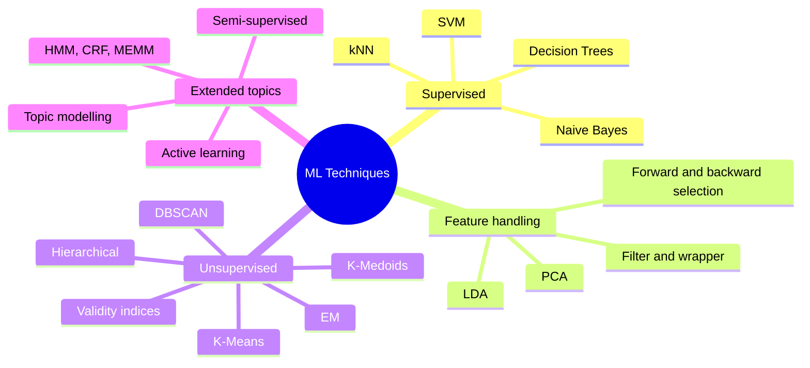
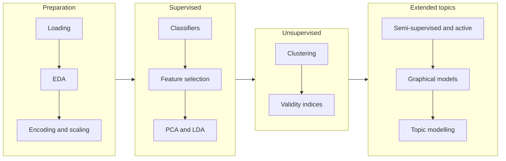

<div align="center">


<p>
  <a href="#overview">Overview</a> &nbsp;|&nbsp;
  <a href="#dataset">Dataset</a> &nbsp;|&nbsp;
  <a href="#syllabus-coverage">Syllabus</a> &nbsp;|&nbsp;
  <a href="#workflow">Workflow</a> &nbsp;|&nbsp;
  <a href="#evaluation-approach">Evaluation</a> &nbsp;|&nbsp;
  <a href="#getting-started">Getting Started</a>
</p>


</div>

<br>

<table align="center">
  <tr>
    <td align="center" width="180"><b>1,000</b><br><sub>customers</sub></td>
    <td align="center" width="180"><b>20</b><br><sub>features</sub></td>
    <td align="center" width="180"><b>2</b><br><sub>classes</sub></td>
    <td align="center" width="180"><b>8</b><br><sub>syllabus areas</sub></td>
  </tr>
</table>

<br>

## Overview

This repository applies every topic of the Machine Learning Techniques syllabus to one dataset, so that different methods can be compared on the same problem. Each notebook explains the concept, shows commented code, and records observations from the results.

The practical component of the course asks for lab work in R or Python that stays in step with the theory classes. This project uses Python.

> [!NOTE]
> Coverage is judged against the syllabus. A topic is included only if the syllabus mentions it.

<br>

## Dataset

<table>
<tr>
<td width="50%" valign="top">

**German Credit Data (Statlog)**
Loaded from OpenML as `credit-g`.

| Property | Value |
|---|---|
| Rows | 1,000 |
| Features | 20 |
| Numeric | 7 |
| Categorical | 13 |
| Target | `class` |
| Class split | 70% good, 30% bad |
| Missing values | None |

</td>
<td width="50%" valign="top">

**Loading the data**

```python
from sklearn.datasets import fetch_openml

data = fetch_openml(
    name="credit-g",
    version=1,
    as_frame=True,
)
df = data.frame
```

No manual download is needed.

</td>
</tr>
</table>

<details>
<summary><b>Show all features</b></summary>

<br>

| Type | Columns |
|---|---|
| Numeric | `duration`, `credit_amount`, `installment_commitment`, `residence_since`, `age`, `existing_credits`, `num_dependents` |
| Categorical | `checking_status`, `credit_history`, `purpose`, `savings_status`, `employment`, `personal_status`, `other_parties`, `property_magnitude`, `other_payment_plans`, `housing`, `job`, `own_telephone`, `foreign_worker` |
| Target | `class` |

</details>

> [!IMPORTANT]
> The German Credit data has no sequences and no text. Graphical models (HMM, CRF, MEMM) and topic modelling therefore use small separate datasets.

<br>

## Syllabus Coverage



| Syllabus area | Topics | Implementation |
|---|---|---|
| Supervised learning | Decision Trees, k-Nearest Neighbours, Naive Bayes, Support Vector Machines | scikit-learn |
| Feature selection | Filter and wrapper approaches, forward and backward selection | scikit-learn |
| Dimensionality reduction | PCA, Linear Discriminant Analysis | scikit-learn |
| Unsupervised learning | K-Means, K-Medoids, Hierarchical, DBSCAN, Expectation Maximization | scikit-learn, scikit-learn-extra |
| Clustering evaluation | Cluster validity indices, similarity measures | scikit-learn |
| Semi-supervised and active learning | Label propagation, self-training, uncertainty sampling | scikit-learn |
| Graphical models | HMM, CRF, MEMM | hmmlearn, sklearn-crfsuite, custom code |
| Topic modelling | Latent Dirichlet Allocation | scikit-learn |

<br>

## Workflow



<br>

## Evaluation Approach

<table>
<tr>
<td width="50%" valign="top">

**Data handling**

- Stratified 80/20 train and test split with a fixed random seed
- Scaling and encoding are fitted on the training set only, to avoid data leakage
- Cross-validation on the training set before the final test evaluation

</td>
<td width="50%" valign="top">

**Metrics**

- Classification: accuracy, precision, recall, F1 score, confusion matrix
- Clustering: silhouette score, Davies-Bouldin index, elbow method
- Accuracy alone is not enough here, since predicting "good" for every customer already scores 70%

</td>
</tr>
</table>

<br>

## Repository Structure

```
ML-Techniques-Lab-Project/
├── README.md
└── notebooks/
    ├── day01_data_load.ipynb
    ├── day02_data_understanding.ipynb
    └── ...
```

Notebooks are numbered in the order they were written and named `dayXX_topic.ipynb`.

<br>

## Notebook Format

| Part | Content |
|---|---|
| Title cell | Course, dataset and the syllabus topic covered |
| Concept cells | Definitions and short notes before each block of code |
| Code cells | Comments explaining each step |
| Observations cell | Findings written after running the code |

<br>

## Getting Started

<details open>
<summary><b>Google Colab (no setup)</b></summary>

<br>

1. Open Google Colab and choose File, then Open notebook, then the GitHub tab
2. Select this repository and open any notebook from the `notebooks/` folder
3. Choose Runtime, then Run all

</details>

<details>
<summary><b>Local setup</b></summary>

<br>

```bash
git clone https://github.com/dhiru69-tech/ML-Techniques-Lab-Project.git
cd ML-Techniques-Lab-Project
pip install pandas numpy matplotlib seaborn scikit-learn
jupyter notebook
```

Later notebooks need extra packages, which are installed in the first cell of the notebook that uses them:

```
scikit-learn-extra    hmmlearn    sklearn-crfsuite    nltk
```

</details>

<br>

## References

- [scikit-learn documentation](https://scikit-learn.org/stable/)
- [German Credit Data on OpenML](https://www.openml.org/search?type=data&q=credit-g)
- Statlog (German Credit Data), UCI Machine Learning Repository

<br>

<div align="center">

**Dhiru**

[](https://github.com/dhiru69-tech)


</div>
